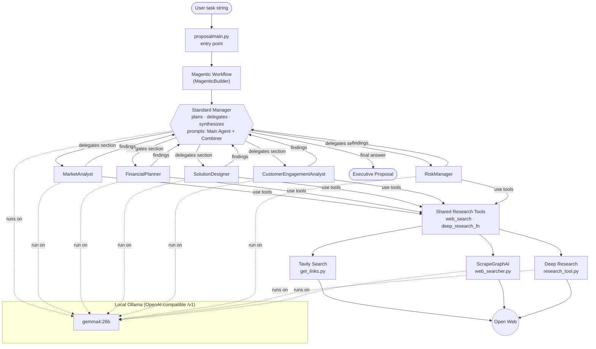
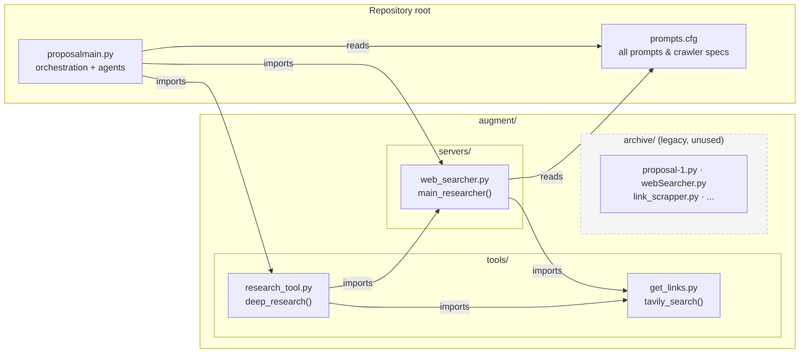
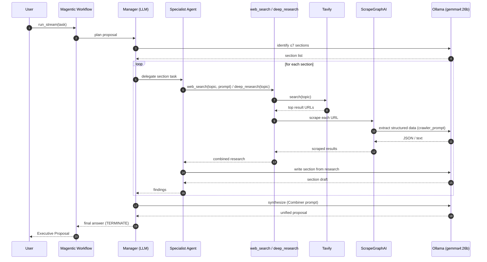
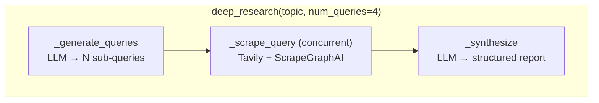

# Proposal Generator

A multi-agent system that automatically researches a topic on the open web and
synthesizes an **executive-ready business proposal**. It uses the
[Microsoft Agent Framework](https://github.com/microsoft/agent-framework)
**Magentic** orchestrator to coordinate five specialized research agents, all
running locally against [Ollama](https://ollama.com/), and grounds their work in
live web data via [Tavily](https://tavily.com/) search + [ScrapeGraphAI](https://scrapegraph-ai.readthedocs.io/)
scraping.

---

## What the solution does (current state)

Given a single task string (e.g. *"Create a proposal for supply chain
optimization system"*), the system:

1. A **Magentic manager** plans the proposal: it decides on ≤ 7 sections and
   delegates each to the most appropriate specialist agent.
2. Five **worker agents** (Market, Financial, Solution, Customer, Risk) each
   research their slice of the problem using two shared tools:
   - `web_search` — Tavily search → scrape the top URLs.
   - `deep_research_fn` — generates multiple sub-queries, scrapes them all
     concurrently, then synthesizes a structured report.
3. The manager **synthesizes** all agent outputs into one polished proposal
   using the `Combiner` prompt, then emits the final document.

Everything is driven through one local model (`gemma4:26b` by default) exposed
over Ollama's OpenAI-compatible API. All agent personas, crawler instructions,
and orchestration prompts live in [prompts.cfg](prompts.cfg).

---

## High-level architecture



---

## Component map



---

## End-to-end request flow



---

## The two research tools

Both tools are plain async callables; Agent Framework derives their schemas from
the type hints and docstrings (no decorators needed).

| Tool | Defined in | What it does |
| --- | --- | --- |
| `web_search(topic, prompt)` | [proposalmain.py](proposalmain.py) → [web_searcher.py](augment/servers/web_searcher.py) | Tavily search for `topic` → scrape the top URLs with ScrapeGraphAI using `prompt`. Returns concatenated scraped text. |
| `deep_research_fn(topic)` | [proposalmain.py](proposalmain.py) → [research_tool.py](augment/tools/research_tool.py) | Ask the LLM for N diverse sub-queries → search + scrape each concurrently → synthesize into a structured report (Overview, Key Findings, Details, Challenges, Recent Developments). |



---

## The five specialist agents

Each agent shares the same tools and Ollama client, but is given a distinct
persona, description, and crawler prompt from [prompts.cfg](prompts.cfg).

| Agent (`name`) | Config section | Focus |
| --- | --- | --- |
| `MarketAnalyst` | `[Market Analysis]` | Industry trends, competition, SWOT, market sizing |
| `FinancialPlanner` | `[Financial Planning]` | Cost/revenue models, ROI, break-even, funding |
| `SolutionDesigner` | `[Solution Design]` | Architecture, features, implementation roadmap |
| `CustomerEngagementAnalyst` | `[Client Engagement]` | Pain points, value propositions, engagement strategy |
| `RiskManager` | `[Risk Management]` | Risk assessment, compliance, mitigation/contingency |

The manager itself is configured from `[Main Agent]` (planning/delegation) and
`[Combiner]` (final synthesis).

---

## Configuration & dependencies

The system expects:

- **Ollama** running locally at `http://localhost:11434` with the configured
  model pulled (default `gemma4:26b`) plus `nomic-embed-text` for scraper
  embeddings.
- A **Tavily API key** in the environment as `TAVILY_API_KEY`.
- A `.env` file (loaded via `python-dotenv`) and the [prompts.cfg](prompts.cfg)
  file present in the working directory.

Relevant environment variables (see [proposalmain.py](proposalmain.py)):

| Variable | Default | Purpose |
| --- | --- | --- |
| `OLLAMA_HOST` | `http://localhost:11434` | Ollama base URL |
| `OLLAMA_MODEL` | `gemma4:26b` | Model id used by all agents |
| `TAVILY_API_KEY` | — | Required for web search |

Key Python libraries: `agent-framework`, `openai`, `scrapegraphai`, `tavily`,
`python-dotenv`.

---

## Running it

```bash
# 1. Start Ollama and pull the models
ollama serve
ollama pull gemma4:26b
ollama pull nomic-embed-text

# 2. Set your Tavily key (e.g. in a .env file)
export TAVILY_API_KEY=tvly-...

# 3. Run the generator
python proposalmain.py
```

The default task is hardcoded in `main()` as *"Create a proposal for supply
chain optimization system"*. Each workflow event is streamed and printed; the
final synthesized proposal is printed at the end.

---

## Notes on current state

- The task string is **hardcoded** in `proposalmain.py:main()` — there is no CLI
  argument or input prompt yet.
- The `augment/archive/` folder holds **earlier, unused** implementations kept
  for reference; the live path is `proposalmain.py` + `augment/servers` +
  `augment/tools`.
- `web_searcher.py` also defines per-domain helpers (`market_researcher`,
  `financial_researcher`, etc.) that wrap `main_researcher` with each section's
  `crawler_prompt`; these are available but the agents currently drive scraping
  through the generic `web_search` / `deep_research_fn` tools.
- Everything runs **locally** against Ollama — no hosted LLM provider is used.
```
